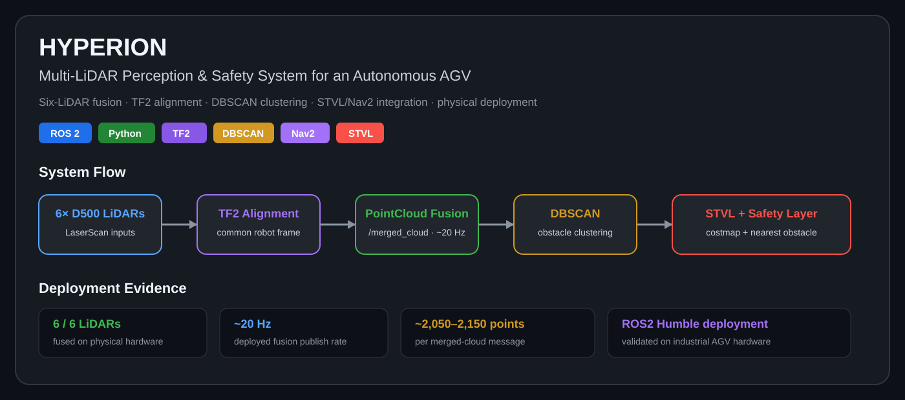
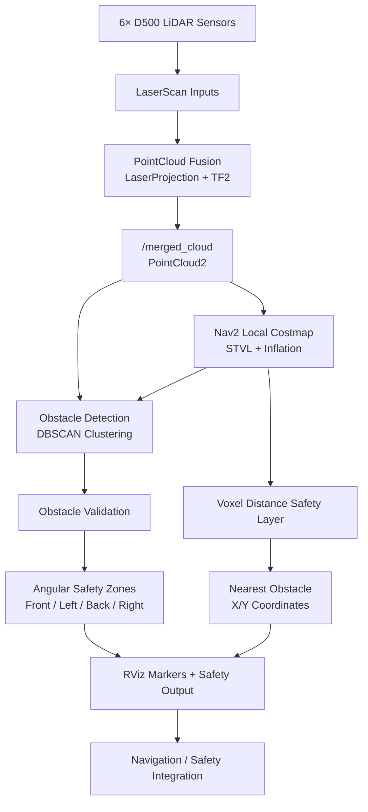

# HYPERION — Multi-LiDAR Perception & Safety System for an Autonomous AGV

> Six-LiDAR sensor fusion, DBSCAN obstacle clustering, and a costmap-integrated safety layer — designed, built, and deployed on a physical industrial AGV.

## Visual Overview



## Overview

Industrial pallet trucks (BOPTs) use multiple LiDAR sensors because no single sensor can provide complete surrounding coverage due to mounting position, blind spots, and field-of-view limitations.

**HYPERION** fuses six independently mounted D500 (STL-19P DTOF) LiDAR sensors into one spatially consistent representation. The resulting point cloud supports real-time obstacle detection, safety-zone classification, nearest-obstacle detection, and integration with the vehicle's Nav2 navigation stack.

The project progressed from a two-sensor development setup to deployment and validation using all six LiDAR sensors on physical industrial hardware.

## Deployment & Test Evidence

These are sanitized captures from the real development and BOPT deployment sessions documented in the project report.

| Six-LiDAR fused cloud | Safety-zone visualization |
|---|---|
|  |  |

| STVL / Nav2 integration | Nearest-obstacle view |
|---|---|
|  |  |

The deployed fusion node was observed publishing from all six LiDARs at approximately **20 Hz**, with roughly **2,050–2,150 points per merged-cloud message**.

## System Architecture



## Key Features

- **Six-LiDAR sensor fusion** into a unified `sensor_msgs/msg/PointCloud2` stream
- **TF2-based coordinate transformation** to align independently mounted sensors into a common robot frame
- **Configurable sensor inputs**, validated with two LiDARs during development and six on deployed hardware
- **DBSCAN obstacle clustering** for density-based obstacle extraction
- **STVL costmap cross-validation** to reduce false detections from isolated LiDAR noise
- **Four angular safety zones**: front, left, back, and right
- **Footprint-aware nearest-obstacle safety layer**
- **Nav2 costmap integration**
- **RViz2 visualization** for sensor, fusion, obstacle, safety, and costmap validation
- **Physical hardware deployment and testing**

## Technical Stack

### Robotics

- ROS2 Jazzy — development
- ROS2 Humble — deployment environment
- TF2
- Nav2
- RViz2
- `sensor_msgs/LaserScan`
- `sensor_msgs/PointCloud2`
- `visualization_msgs/Marker`
- `laser_geometry`

### Perception & Processing

- Python
- NumPy
- Scikit-learn
- DBSCAN clustering
- Open3D for offline point-cloud experiments and ICP registration

### Navigation & Spatial Representation

- Nav2 Costmap 2D
- Spatio-Temporal Voxel Layer (STVL)
- Inflation Layer
- TF-based multi-sensor alignment

### Development & Deployment

- Ubuntu
- colcon
- rosbag2 / recorded-data testing
- SSH-based deployment
- Git / GitHub

## Repository Structure

```text
hyperion-agv-perception/
├── README.md
├── .gitignore
├── requirements.txt
├── docs/
│   ├── architecture.png
│   └── screenshots/
└── src/
    ├── agv_safety/
    │   ├── agv_safety/
    │   │   ├── obstacle_detector.py
    │   │   └── voxel_distance_node.py
    │   └── launch/
    │
    ├── apds_lidar_clustering/
    │   ├── apds_lidar_clustering/
    │   │   ├── pointcloud_fusion.py
    │   │   ├── scan_to_cloud.py
    │   │   └── lidar_dummy.py
    │   └── launch/
    │
    └── costmap_pkg/
        ├── config/
        │   └── costmap.yaml
        └── launch/
            └── stvl_costmap_launch.py
```

> The third-party `ldlidar_stl_ros2` LiDAR driver is intentionally not included in this repository. It is an external dependency and is not presented as original project code.

## Perception Pipeline

The complete perception pipeline follows these stages:

### 1. LiDAR Acquisition

Each configured LiDAR publishes an independent `LaserScan` stream.

The fusion node subscribes to the configured sensor topics using ROS2 sensor-data QoS.

### 2. LaserScan → PointCloud2

Each `LaserScan` is projected into a point cloud using:

`laser_geometry.LaserProjection`

Working in point-cloud space allows data from physically separated sensors to be transformed into a common coordinate frame before fusion.

### 3. TF2 Coordinate Transformation

Each LiDAR is mounted at a different position and orientation on the vehicle.

TF2 transforms each sensor's point cloud from its local sensor frame into the shared robot/base frame.

This is essential because directly concatenating measurements expressed in different coordinate frames would produce a spatially incorrect representation.

### 4. Multi-LiDAR Fusion

The transformed clouds are combined into:

`/merged_cloud`

Message type:

`sensor_msgs/msg/PointCloud2`

A timer-based fusion architecture allows the node to publish using currently available sensor data rather than requiring every sensor callback to arrive simultaneously.

### 5. DBSCAN Obstacle Detection

The fused cloud is processed using DBSCAN density-based clustering.

Validated configuration:

```text
eps = 0.10
min_samples = 5
min_cluster_points = 12
```

DBSCAN groups spatially dense LiDAR returns while assigning isolated points to the noise label (`-1`).

Clusters below the configured minimum point count are discarded.

For accepted clusters, the perception layer determines information such as:

- centroid
- approximate radius
- center distance
- nearest surface point
- nearest surface distance

### 6. STVL Cross-Validation

The fused point cloud also feeds a Spatio-Temporal Voxel Layer costmap.

Detected clusters can be checked against independently occupied costmap regions before being treated as confirmed obstacles.

This provides an additional noise-rejection mechanism rather than relying exclusively on clustering output.

### 7. Safety-Zone Classification

Confirmed obstacles are classified into four non-overlapping angular regions around the vehicle:

- Front
- Left
- Back
- Right

This converts generic obstacle coordinates into information that can be consumed more directly by a vehicle safety system.

### 8. Nearest-Obstacle Safety Layer

A separate safety node processes voxel/costmap information to determine the nearest occupied obstacle relative to the robot.

Distance calculations use the robot's base coordinate frame and focus on the X/Y plane.

The robot footprint is excluded so that the vehicle itself is not incorrectly identified as an obstacle.

## Why PointCloud Fusion Instead of LaserScan Merging?

An earlier implementation attempted to merge raw `LaserScan` streams directly.

This produced inconsistent spatial output because measurements from separately mounted sensors were represented in different coordinate frames.

The architecture was therefore changed to:

```text
LaserScan
    ↓
PointCloud2
    ↓
TF2 transformation
    ↓
Common robot frame
    ↓
Point-cloud fusion
```

Transforming each sensor into the common frame **before fusion** produced a spatially meaningful representation of the vehicle's surroundings.

This became one of the core architectural decisions in HYPERION.

## Coordinate Transformations

Multi-LiDAR fusion depends on accurate coordinate transformations.

Each LiDAR has:

- its own sensor frame
- a physical mounting position
- a mounting orientation
- a transform relative to the robot base

TF2 maintains these relationships.

Conceptually:

```text
LiDAR 1 ─┐
LiDAR 2 ─┤
LiDAR 3 ─┤
LiDAR 4 ─┼── TF2 ──> Robot Base Frame ──> Unified Point Cloud
LiDAR 5 ─┤
LiDAR 6 ─┘
```

Without this transformation stage, individually valid sensor measurements cannot be reliably interpreted together.

## Nav2 / STVL Integration

HYPERION integrates the fused LiDAR cloud with the robot's navigation environment through a Nav2 local costmap.

The spatial layer uses:

- **STVL** for voxel-based obstacle representation
- **Inflation Layer** for obstacle inflation around occupied regions

The fused point cloud acts as an observation source for the costmap.

This allows the perception system and navigation stack to operate using a common spatial representation instead of maintaining completely separate obstacle models.

## Visualization

RViz2 was used throughout development and deployment for validation.

The visualization workflow included:

- individual LiDAR scans
- transformed sensor data
- merged six-LiDAR point cloud
- DBSCAN obstacle clusters
- safety-zone markers
- nearest-obstacle visualization
- STVL/local costmap
- robot footprint
- TF frames
- Nav2 visualization

RViz was particularly important during hardware deployment because it allowed spatial errors to be distinguished from ROS graph, TF, costmap, and perception-algorithm issues.

## Testing & Validation

HYPERION was tested at multiple levels rather than only after deployment.

### Offline Testing

Dummy sensor publishers and recorded data were used to exercise fusion and perception logic without requiring continuous access to the physical robot.

This helped separate:

- algorithm errors
- missing sensor input
- TF problems
- hardware/deployment problems

### Point-Cloud Validation

Raw and fused point clouds were visually inspected during development to confirm that transformations and fusion produced spatially consistent output.

### ROS2 Graph Validation

During deployment, the ROS2 graph and key topics were inspected using tools such as:

```bash
ros2 topic list
ros2 topic hz /merged_cloud
ros2 topic echo <topic>
```

TF relationships and costmap lifecycle state were also checked independently.

### Physical Obstacle Validation

Physical obstacles were placed around the vehicle and compared with the reported obstacle position / nearest-obstacle coordinates and RViz visualization.

### Six-Sensor Deployment

The final fusion architecture was generalized from the initial two-LiDAR development setup to the vehicle's six-sensor configuration.

The deployed system successfully fused all six configured LiDAR streams.

## Results

The following values were observed during project development/deployment.

| Metric | Result |
|---|---|
| Deployed LiDAR configuration | 6 sensors |
| Fusion publish rate | ~20 Hz |
| Points per merged-cloud message | ~2,050–2,150 |
| DBSCAN `eps` | 0.10 |
| DBSCAN `min_samples` | 5 |
| Minimum accepted cluster size | 12 points |
| Safety-layer cluster tolerance | 0.15 m |
| Safety-layer minimum cluster size | 3 points |
| Costmap update rate | 10 Hz |

> These are implementation/deployment measurements, not claims of benchmarked detection accuracy. A controlled accuracy and false-positive benchmark was not completed as part of the project.

## Engineering Challenges & Decisions

### 1. Unreliable LaserScan Merging

**Problem:** Directly merging scans from differently mounted LiDAR sensors produced inconsistent output.

**Decision:** Convert each scan to PointCloud2 and transform it into a common coordinate frame before fusion.

---

### 2. Development vs Deployment TF Differences

**Problem:** Frame naming and TF assumptions used during development did not map directly onto the deployed robot.

**Decision:** Inspect the live TF tree and configure the perception system against the actual vehicle frames rather than relying on development assumptions.

---

### 3. Scaling From Two to Six LiDAR Sensors

**Problem:** The original development architecture assumed a small, fixed sensor configuration.

**Decision:** Generalize the fusion pipeline so sensor topics could be configured and missing/delayed inputs would not unnecessarily block the entire fusion process.

---

### 4. STVL / Costmap Lifecycle Issues

**Problem:** Launching a Nav2 costmap node did not necessarily mean that the lifecycle-managed node was active and publishing correctly.

**Decision:** Debug TF dependencies, plugin configuration, lifecycle state, autostart behavior, and lifecycle-manager configuration separately.

---

### 5. Distinguishing Missing Data From Algorithm Failure

**Problem:** Offline testing occasionally lacked expected recorded sensor frames.

**Decision:** Treat missing input, perception-algorithm bugs, and deployment-environment failures as separate failure classes during debugging.

## Limitations

The current implementation has several known limitations:

- No persistent obstacle tracking between frames
- No dynamic-vs-static obstacle classification
- DBSCAN cluster identities are frame-local
- Some perception distance calculations approximate obstacle geometry
- Costmap-based validation depends on reliable STVL availability
- Reflective surfaces, sparse returns, heavy occlusion, and other LiDAR edge cases have not been systematically benchmarked
- Controlled detection-accuracy and false-positive benchmarks have not yet been completed
- End-to-end sensor-to-safety-output latency has not yet been formally benchmarked

## Future Improvements

Potential extensions include:

- Persistent cross-frame obstacle tracking
- Dynamic vs. static obstacle classification
- True minimum-distance-to-obstacle-surface calculation
- Oriented bounding boxes for detected obstacles
- Persistent obstacle IDs
- Distance and obstacle-ID labels in RViz
- Downstream velocity scaling based on nearest-obstacle distance
- More resilient STVL/costmap handling
- Controlled detection-accuracy benchmarking
- End-to-end latency measurement
- Automated deployment/testing pipeline

## Development Journey

The project evolved through several stages:

```text
Single / Dual LiDAR Development
            ↓
LaserScan Fusion Experiments
            ↓
PointCloud2 Conversion
            ↓
TF2-Based Sensor Alignment
            ↓
Multi-LiDAR PointCloud Fusion
            ↓
DBSCAN Obstacle Detection
            ↓
Safety-Zone Classification
            ↓
Nav2 + STVL Costmap Integration
            ↓
Nearest-Obstacle Safety Layer
            ↓
Six-LiDAR Physical Deployment
```

The main engineering value of the project was not simply producing a merged point cloud, but developing and validating the complete path from heterogeneous sensor inputs to safety-relevant spatial information on physical hardware.

## Screenshots & Demo

The evidence above is extracted from the real project report and sanitized for public use. It shows the fused six-LiDAR point cloud, safety-zone visualization, STVL/Nav2 integration, and nearest-obstacle deployment view.

> Internal IP addresses, hostnames, usernames, credentials, and company-sensitive terminal details are intentionally excluded from the public evidence set.

## Dependencies

Core dependencies include:

```text
ROS2
Nav2
TF2
laser_geometry
NumPy
scikit-learn
Open3D
```

Python dependencies used by the repository should also be listed in `requirements.txt`.

The D500/STL-19P ROS2 driver is an external dependency and is intentionally excluded from this repository.

## Build

From a ROS2 workspace containing the repository packages:

```bash
cd ~/hyperion_ws

colcon build --packages-select \
  agv_safety \
  apds_lidar_clustering \
  costmap_pkg

source install/setup.bash
```

> Exact launch commands depend on the sanitized launch files retained in this public repository. They should be verified against the final repository structure before use.

## Security & Publication Notes

This repository is a sanitized portfolio version of work completed during an internship.

The public version excludes:

- credentials
- internal IP addresses
- deployment usernames
- internal hostnames
- company-private paths
- proprietary third-party source code
- unnecessary deployment-specific configuration

## Project Scope

HYPERION was developed as an applied robotics/perception project focused on:

**Sensor Fusion → Spatial Perception → Obstacle Detection → Safety Representation → Navigation Integration**

It is intended as a technical portfolio demonstration of ROS2 perception-system design, integration, debugging, and physical deployment.

## Author

**Yashika Sharma**

B.Tech Computer Science (Data Science)

Interests: Applied AI · Autonomous Systems · Robotics Perception · Product & Systems Design

---

*HYPERION — Multi-LiDAR Perception & Safety System for an Autonomous AGV*
