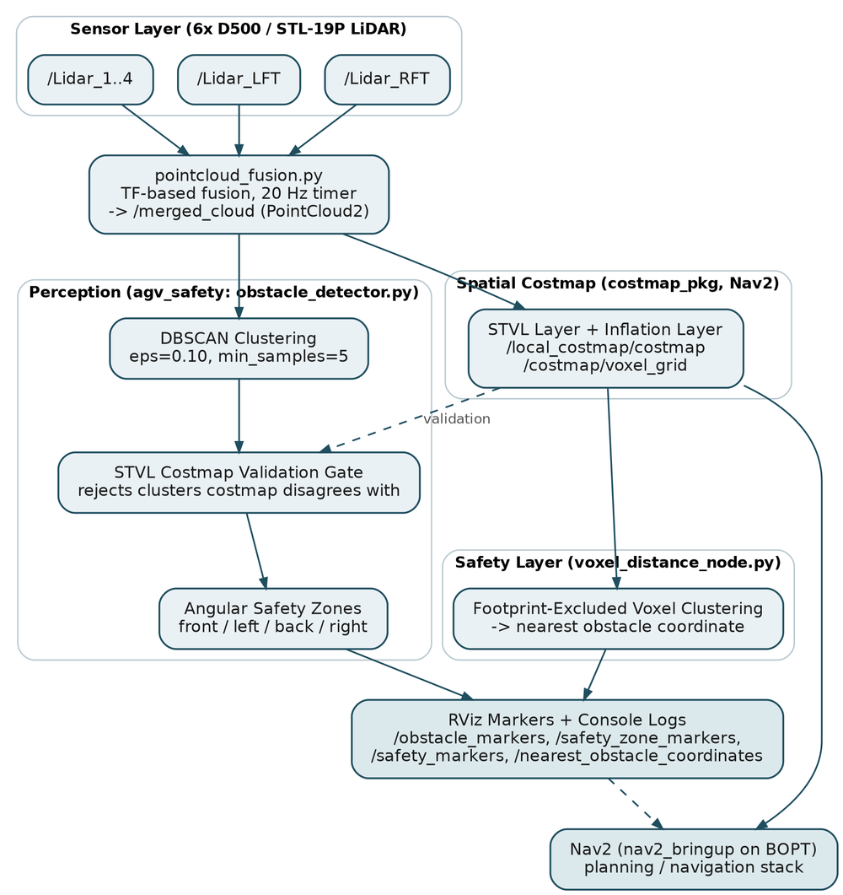
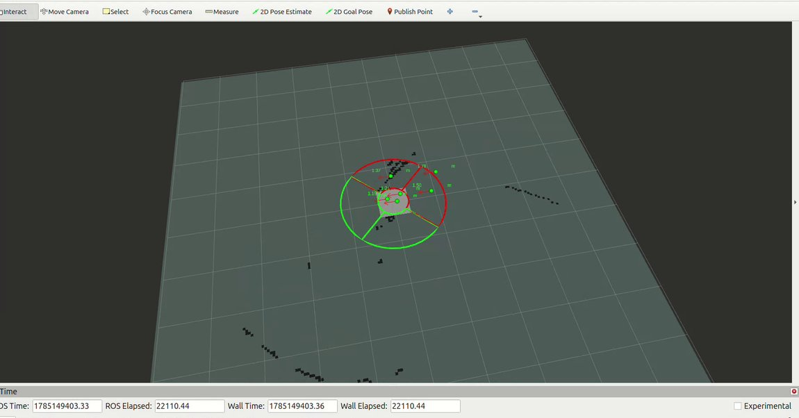
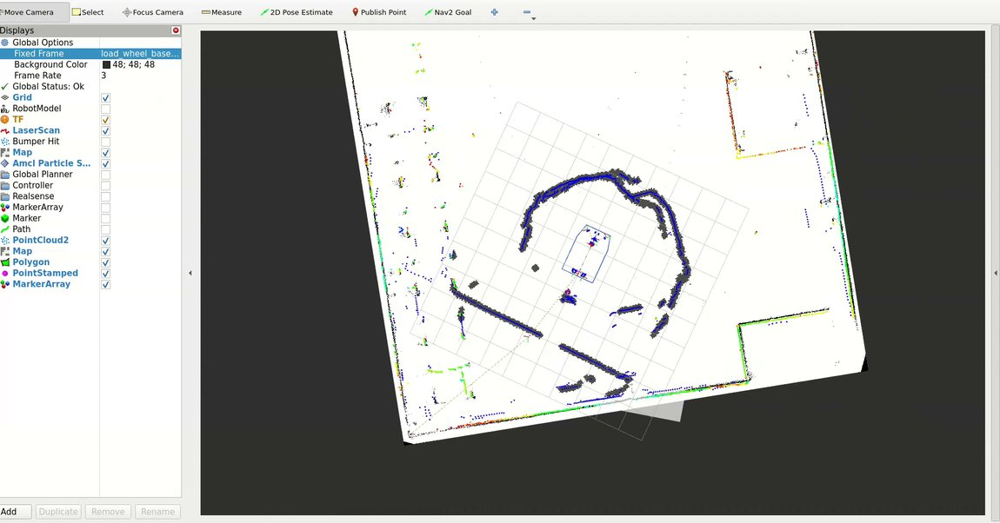
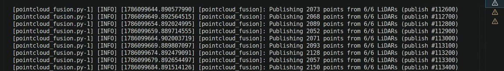

# HYPERION — Multi-LiDAR Perception & Safety for an Autonomous AGV

> ROS2 perception pipeline for six-LiDAR fusion, DBSCAN obstacle extraction, STVL/Nav2 integration, and nearest-obstacle safety logic on an industrial BOPT/AGV.

## Overview

HYPERION was developed to create a unified perception and safety layer from multiple independently mounted 2D LiDAR sensors. The system converts each `LaserScan` into `PointCloud2`, transforms all sensor data into a shared robot frame using TF2, fuses the streams at a fixed rate, extracts obstacle clusters, and integrates the result with a Nav2 Spatio-Temporal Voxel Layer (STVL).

The project progressed from dual-LiDAR development to a six-sensor hardware deployment.

## System Architecture

<p align="center">
  
</p>

```text
6 × LiDAR LaserScan streams
          ↓
LaserScan → PointCloud2
          ↓
TF2 transform into robot base frame
          ↓
Fixed-rate multi-LiDAR fusion
          ↓
      /merged_cloud
       ↙          ↘
DBSCAN          Nav2 / STVL
clustering      voxel costmap
   ↓                ↓
Directional     Nearest supported
safety zones    obstacle + safety state
```

## Real Deployment Evidence

These are sanitized captures from the actual development and BOPT deployment sessions documented in the project report.

### Six-LiDAR Fusion — RViz

<p align="center">
  
</p>

### Safety-Zone Validation

<p align="center">
  
</p>

### Nav2 / STVL Integration

<p align="center">
  
</p>

### Fusion Log — 6/6 LiDARs

<p align="center">
  
</p>

### Physical BOPT Validation

<p align="center">
  
</p>

**Observed deployment result:** all **6 LiDARs** contributed to the fused stream at approximately **20 Hz**, with roughly **2,050–2,150 points per merged-cloud message** during the documented run.

## Core Components

### 1. Multi-LiDAR Fusion

`src/apds_lidar_clustering/apds_lidar_clustering/pointcloud_fusion.py`

- subscribes to six configurable `sensor_msgs/LaserScan` topics;
- projects each scan with `laser_geometry.LaserProjection`;
- transforms each cloud into a common frame with TF2;
- fuses available sensors at a configurable fixed rate;
- publishes `/merged_cloud` as `sensor_msgs/PointCloud2`;
- continues publishing when one sensor is temporarily unavailable instead of blocking the entire pipeline.

Default deployment topics:

```text
/Lidar_1
/Lidar_2
/Lidar_3
/Lidar_4
/Lidar_LFT
/Lidar_RFT
```

### 2. DBSCAN Obstacle Detection

`src/agv_safety/agv_safety/obstacle_detector.py`

The fused cloud is clustered using DBSCAN. The public configuration retains the values validated during project development:

```text
eps = 0.10
min_samples = 5
minimum accepted cluster = 12 points
```

Clusters can be cross-checked against the STVL occupancy grid before being accepted. Confirmed obstacles are published as poses and classified into front, left, back, or right directional safety regions.

### 3. STVL / Nav2 Costmap

`src/costmap_pkg/config/stvl_costmap.yaml`

The fused point cloud is used as the observation source for a Nav2 local costmap configured with:

- Spatio-Temporal Voxel Layer;
- rolling 10 m × 10 m window;
- 0.05 m resolution;
- 10 Hz costmap update/publish rate;
- robot footprint exclusion;
- inflation layer.

### 4. Nearest-Obstacle Safety Layer

`src/agv_safety/agv_safety/voxel_distance_node.py`

The safety node consumes STVL voxel output instead of using the raw LiDAR cloud directly. It:

- transforms occupied voxels into the robot frame;
- ignores returns inside the robot footprint;
- rejects isolated voxel returns using an XY support threshold;
- finds the nearest supported obstacle in the X/Y plane;
- publishes nearest distance, safety state, and RViz markers.

Default public thresholds:

```text
STOP ≤ 0.60 m
SLOW ≤ 1.20 m
SAFE > 1.20 m
cluster tolerance = 0.15 m
minimum supported voxels = 3
```

## Repository Structure

```text
hyperion-agv-perception/
├── README.md
├── .gitignore
├── requirements.txt
├── docs/
│   └── screenshots/
│       ├── architecture_diagram.png
│       ├── deployment_bopt.jpg
│       ├── rviz_fused_cloud.jpg
│       ├── safety_zone_visualization.jpg
│       ├── stvl_nav2_integration.jpg
│       └── terminal_fusion_log.jpg
└── src/
    ├── agv_safety/
    │   ├── agv_safety/
    │   │   ├── obstacle_detector.py
    │   │   └── voxel_distance_node.py
    │   ├── launch/
    │   │   └── safety.launch.py
    │   ├── CMakeLists.txt
    │   └── package.xml
    ├── apds_lidar_clustering/
    │   ├── apds_lidar_clustering/
    │   │   └── pointcloud_fusion.py
    │   ├── launch/
    │   │   └── pointcloud_fusion.launch.py
    │   ├── CMakeLists.txt
    │   └── package.xml
    └── costmap_pkg/
        ├── config/
        │   └── stvl_costmap.yaml
        ├── launch/
        │   └── stvl_costmap.launch.py
        ├── CMakeLists.txt
        └── package.xml
```

The original workspace also contained build/install/log artifacts, recorded development data, deployment-specific duplicates, and a third-party LiDAR driver. Those are intentionally excluded from this public portfolio repository.

## Technical Stack

**Robotics:** ROS2 Humble/Jazzy, TF2, Nav2, RViz2, STVL, `laser_geometry`

**Perception:** Python, NumPy, scikit-learn DBSCAN, `LaserScan`, `PointCloud2`, occupancy grids

**Deployment:** Ubuntu, colcon, SSH-based robot deployment, rosbag/offline testing, Git/GitHub

## Build

Clone this repository into a ROS2 workspace:

```bash
mkdir -p ~/hyperion_ws/src
cd ~/hyperion_ws/src
git clone https://github.com/yyashikasharmaa/hyperion-agv-perception.git
cd ..

python3 -m pip install -r src/hyperion-agv-perception/requirements.txt

colcon build --packages-select \
  apds_lidar_clustering \
  agv_safety \
  costmap_pkg

source install/setup.bash
```

The external LiDAR driver and the Nav2 STVL plugin must already be installed in the ROS2 environment.

## Run

Start six-LiDAR fusion:

```bash
ros2 launch apds_lidar_clustering pointcloud_fusion.launch.py
```

Start the STVL costmap:

```bash
ros2 launch costmap_pkg stvl_costmap.launch.py
```

Start the perception and safety nodes:

```bash
ros2 launch agv_safety safety.launch.py
```

Useful validation commands:

```bash
ros2 topic hz /merged_cloud
ros2 topic echo /safety_status
ros2 topic echo /nearest_obstacle_distance
ros2 topic list
```

The default launch/configuration reflects the sanitized deployment architecture. Frame names and physical footprint parameters may need adjustment for a different robot.

## Key Engineering Decisions

**PointCloud fusion instead of raw LaserScan merging.** Measurements from separately mounted LiDARs must first be transformed into a common coordinate frame. Direct scan concatenation produced spatially inconsistent output during development.

**Fixed-rate fusion.** Fusion is timer-driven rather than requiring synchronized callbacks from every LiDAR. This makes the merged stream more tolerant of small differences in sensor timing and temporary missing input.

**Costmap cross-validation.** DBSCAN provides geometric obstacle candidates while STVL provides an independently maintained spatial occupancy representation. Using both helps reject isolated LiDAR noise.

**Safety from STVL output.** The nearest-obstacle layer reads the temporally filtered voxel representation rather than making stop/slow decisions directly from the same raw fused cloud.

## Validation Summary

| Item | Observed / configured value |
|---|---:|
| Physical deployment LiDARs | 6 |
| Fusion rate | ~20 Hz |
| Points per merged message | ~2,050–2,150 |
| DBSCAN `eps` | 0.10 |
| DBSCAN `min_samples` | 5 |
| Minimum accepted DBSCAN cluster | 12 points |
| STVL resolution | 0.05 m |
| Costmap update rate | 10 Hz |
| Safety cluster tolerance | 0.15 m |
| Minimum safety cluster support | 3 voxels |

These values are implementation/deployment observations, **not benchmarked perception-accuracy claims**. A controlled false-positive, detection-accuracy, and end-to-end latency benchmark was outside the completed project scope.

## Limitations

- no persistent obstacle tracking across frames;
- no dynamic/static object classification;
- DBSCAN cluster IDs are frame-local;
- performance depends on accurate TF and sensor mounting calibration;
- costmap validation depends on STVL availability;
- reflective surfaces, occlusion, sparse returns, and other LiDAR edge cases were not systematically benchmarked;
- the public repository is a sanitized portfolio version, not the complete internal robot workspace.

## Security / Publication Notes

The public repository intentionally excludes credentials, internal IP addresses, deployment usernames and hostnames, company-specific local paths, build logs, recorded binary test data, and third-party LiDAR-driver source.

## Project Scope

**Sensor Fusion → Spatial Perception → Obstacle Detection → Safety Representation → Navigation Integration**

HYPERION demonstrates end-to-end ROS2 perception-system design, TF debugging, navigation-stack integration, safety-layer development, and physical robot deployment.

## Author

**Yashika Sharma**  
B.Tech Computer Science (Data Science)
